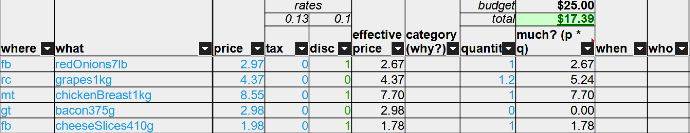

# Read this - 5w2h in groceries shopping

A method to plan my shopping trips using the [5W2Hs](https://www.indeed.com/career-advice/career-development/5w2h-analysis)

_Example_:


## Usage

0. Download the [Excel](https://github.com/skedastically/groceries-5w2h/raw/main/groceries.xlsx)/[ODS](https://github.com/skedastically/groceries-5w2h/raw/main/groceries.ods) file and open it.

1. Add `planned` and `shopped` dates.

2. Enter your budget (cell `I1`).

3. Browse the [flyers](#flyers) and choose the items you like.

4. In each row, log down `what` the item is, `where` to get it and its listed `price`.

   - Use shortcodes as listed in `$Discount` sheet (e.g. `fb` for Food Basics). The workbook will VLOOKUP() relevant stores to find discounts (`disc`)

   - Toggle on tax (`tax`) if necessary (0=no tax (default), 1=taxed)

5. Assign `category` to each line item (vegetables? fruits? meat? i.e. `why` you buy it)

6. Sort table by `category`.

7. For each category, choose the best deal(s) based on `price` and `where`, and input quantity bought in `quantity`. Try not to go over your budget.

8. Sort table by `where`, and **filter out empty values** in `quantity`. You will have a list of your final items.

9. Determine `when` to shop - which store to go first-to-last in a particular order.

10. (optional, in groups) Determine `who` to shop for each store.

> *Notes: Edit the `Discount` sheet and the discount/tax rates per your needs.*

## Flyers

For simplicity, use Flipp -> https://flipp.com

Otherwise, here is a list of relevant store flyers

### Groceries

- [FoodBasics](https://www.foodbasics.ca/flyer)
- [Real Canadian Superstore](https://www.realcanadiansuperstore.ca/print-flyer)
- [No Frills](https://www.nofrills.ca/print-flyer)
- [Walmart](https://www.walmart.ca/flyer)
- [Giant Tiger](https://www.gianttiger.com/collections/flyers-and-deals?view=flyers) [a]
- [Metro](https://www.metro.ca/en/flyer)
- [ValuMart](https://www.valumart.ca/print-flyer) [a],[b]
- [FreshCo](https://freshco.com/flyer/)
- [Loblaws](https://www.loblaws.ca/print-flyer)
- [Sobeys](https://www.sobeys.com/en/flyer/)
- [Costco](https://www.costco.ca/coupons.html) [a]

### Non-groceries

- [Rexall](https://www.rexall.ca/eflyer/) [a],[b]
- [Shopper's Dryg Mart](https://www.shoppersdrugmart.ca/en/flyer) [a],[b]
- [Forest City Surplus](https://www.fcsurplus.com/flyer.pdf)
- [Canadian Tire](https://www.canadiantire.ca/en/flyer.html)

[a]: requires zip code  
[b]: requires store selection  

Additions welcomed.

## Advanced usage

### Suggested syntax of `what` field

```txt
In camel case:

  [item name]
+ [item characteristics]
+ [brand name] 
+ [unit of measurement]

Examples:

- onionsRed7lb
- broccoli1ea (one each)
- detergentBrandName700ml
```

This makes it easier to fuzzy-query item name and prices per kg/lb. Sorting by item name first is also good for comparisons.

Discussions on improvements welcomed.

### Discounts setup

Go to the `Discount` worksheet to set up the stores and their shortcodes.

### Other tips

- "Duplicate sheet" to create new plans every week.

- Set a timer towards your next bus to avoid **wasting time**[^1] in the store.

- Think of shopping not as a relaxing period, but a game we have to play in life.

[^1]: "Time is money only when you have money. If you don't have money, time doesn't mean shit" - D.J.
